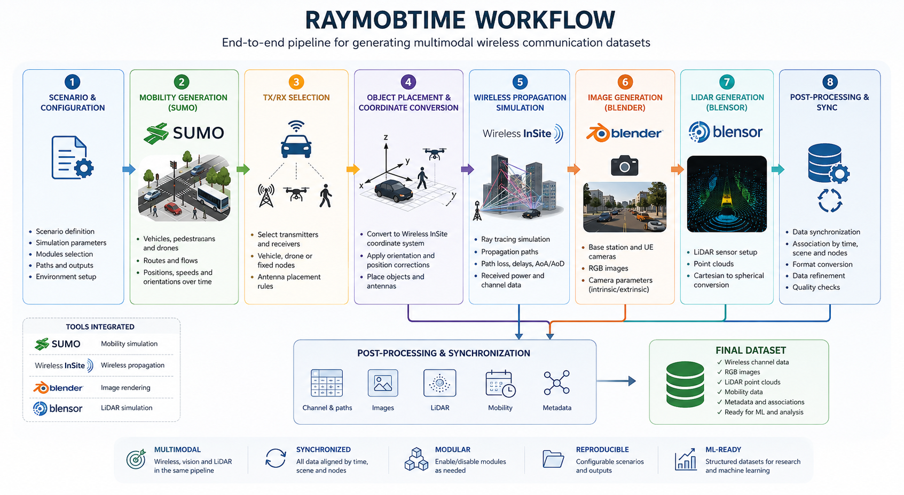
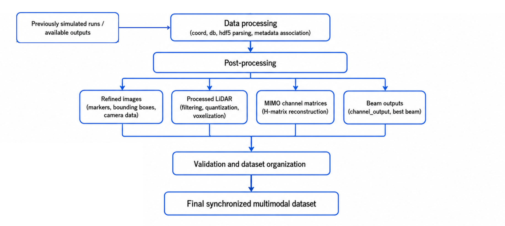
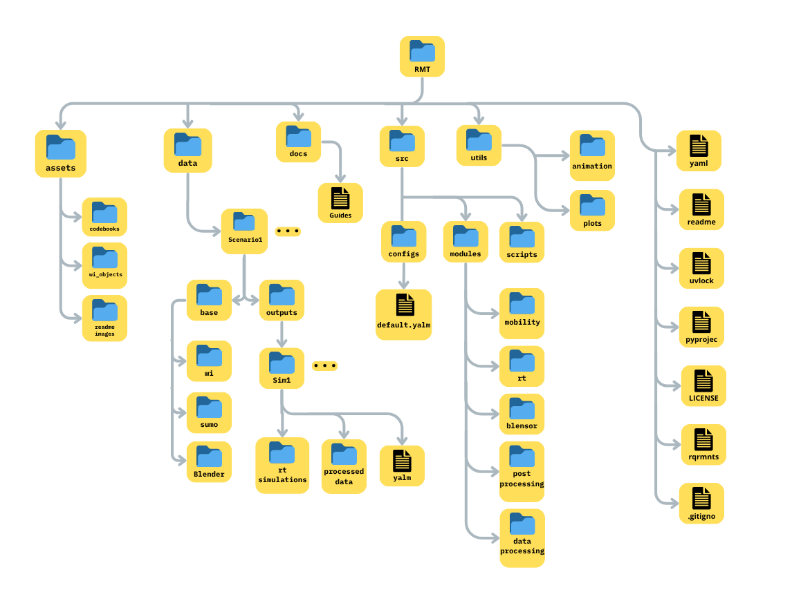
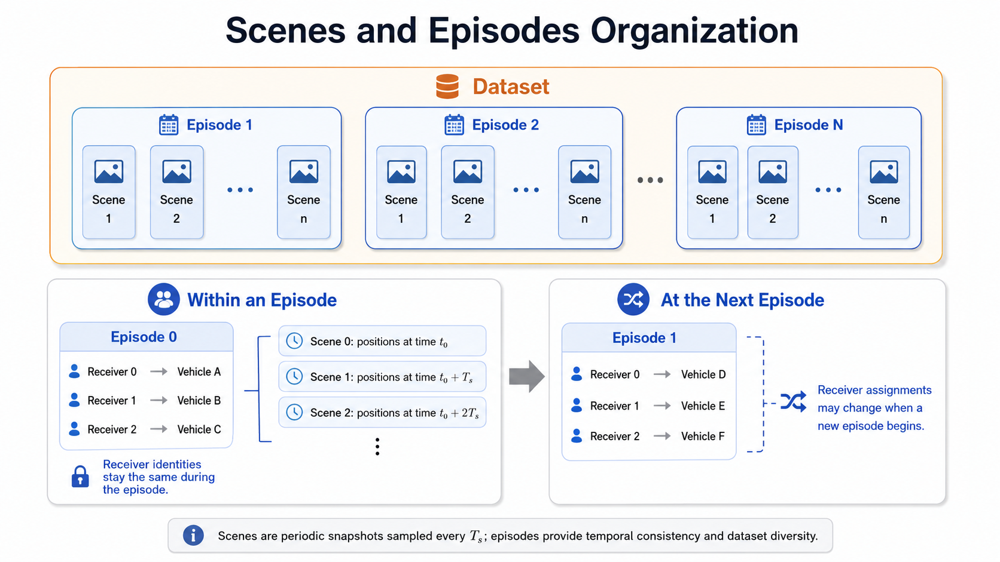

# Raymobtime

Raymobtime is a simulation framework and dataset-generation methodology developed for wireless communication systems with mobility and multimodal sensing. It was originally created to support the generation of realistic ray-tracing datasets for vehicular communication scenarios, especially those involving millimeter-wave and MIMO systems. Its methodology considers mobility and temporal evolution in order to preserve consistency across time, frequency, and space. The current Raymobtime pipeline integrates traffic simulation, electromagnetic ray tracing, image rendering, and LiDAR simulation into a unified simulation and processing workflow. This integration allows the generation of time-aligned datasets composed of electromagnetic propagation, mobility data, RGB images and LiDAR point clouds.

The framework is capable of simulating dynamic communication environments composed of vehicles, buses, trucks, pedestrians, drones, transmitters, receivers, buildings, roads, and other environmental elements. Its main objective is to support the creation of reproducible datasets for research in vehicular communications, wireless channel modeling, millimeter-wave and MIMO systems, positioning, integrated sensing and communication, computer vision, sensor fusion, and machine learning.

The main simulation parameters, enabled modules, scenario paths, input files, and output directories are defined through the Raymobtime configuration system. The orchestration stage uses this configuration to determine the execution order and activate only the modules required for the selected dataset.

---

## Overview

Raymobtime coordinates the execution of several simulation and data-processing stages:

<p align="center">
  
</p>

<p align="center">
  <em>Overview of the Raymobtime dataset-generation workflow.</em>
</p>

---

## Quick Start

<p align="center">
  
</p>

<p align="center">
  <em>Part of Raymobtime pipeline, for quick start.</em>
</p>

Clone Raymobtime repository.
```bash
git clone https://github.com/lasseufpa/Raymobtime.git
cd raymobtime
```
Run this script for
- installing uv 
- download blensor 
- download tiny scenario with ray-tracing stage already done. 
- configure config.yaml for setting desired outputs and workflow.

```bash
source ./src/scripts/quick_start_setup.sh
```
Execute pipeline from image above. Generates data structures, images from BS and UEs POV, lidar data from UEs, post-processes lidar for generating lidar voxels and images to produce bounding boxes and marked points at receivers, also post-process rays data for produce beams data.
```bash
uv run raymobtime
```
The outputs are organized at ```/data/rosslyn_QS/out/sim_default``` folder.

---

## Folder organization

A simplified representation of the Raymobtime project structure is shown below:

<p align="center">
  
</p>

<p align="center">
  <em>Simplified organization of the main Raymobtime directories and files.</em>
</p>

Raymobtime follows a modular architecture in which the main simulation, processing, and dataset-generation responsibilities are separated into dedicated directories and modules. The repository is organized to distinguish configuration files, reusable assets, scenario data, documentation, executable scripts, simulation modules, post-processing routines, and auxiliary visualization tools. This organization makes the project easier to maintain and allows new functionalities to be incorporated without affecting unrelated parts of the workflow.

The `src` directory contains the main Raymobtime source code. It is divided into configuration files, functional modules, and execution scripts. The `src/configs` directory stores the default configuration used by the framework, while `src/scripts` contains the main command-line entry point and the utilities responsible for loading, validating, and organizing the runtime configuration.

The core simulation logic is located in `src/modules`. Each subdirectory represents a major stage of the Raymobtime pipeline. The `mobility` module manages interaction with SUMO and the retrieval of dynamic object positions. The `rt` module contains the Wireless InSite modeling, simulation, and ray-tracing processing logic. The `blensor` module is responsible for Blender and Blensor integration, including RGB image generation, LiDAR scans, camera information extraction, and temporary runtime configuration files. The `data_processing` module converts raw simulator outputs into structured dataset representations, while the `postprocessing` module performs refinement, time alignment, coordinate transformations, and the generation of derived outputs.

The `assets` directory stores reusable resources that are independent of a specific simulation scenario. The `codebooks` subdirectory contains antenna and beamforming codebooks used during wireless channel processing. The `wi_objects` subdirectory contains detailed object templates that can be imported into Wireless InSite, including models for cars, buses, trucks, pedestrians, and drones. The `readme_images` subdirectory stores figures and diagrams used in the project documentation.

The `data` directory contains scenario-specific input files and generated outputs. Each scenario is organized in its own subdirectory and typically contains a `base` directory and an `outputs` directory. The `base` directory stores the static files required to run the scenario, including SUMO network and route files, Wireless InSite base projects, and Blender scene files. The `outputs` directory stores the results generated by individual simulations.

Within a scenario, the SUMO files define the road network, routes, traffic flows, vehicles, pedestrians, and other mobile objects. Wireless InSite files define the static electromagnetic propagation environment, while Blender files define the corresponding visual and sensing environment. These base files are reused during multiple simulation runs.

Each simulation output directory may contain the raw ray-tracing results, processed wireless data, images, LiDAR scans, metadata, and configuration files associated with the corresponding run. Organizing the outputs by scenario and simulation identifier preserves the relationship among the input configuration, the generated scenes, and the final dataset files.

The `doc` directory contains supporting documentation that complements the main README. It may include instructions for creating new base scenarios, developer good practices, execution tutorials, setup instructions, dataset-generation guides, and descriptions of the internal workflow. The main README provides a general overview, while the documents in `doc` provide more detailed operational and development information.

The `utils` directory contains auxiliary tools that are not part of the main simulation pipeline. The `animation` subdirectory contains utilities for generating visual representations of mobility or simulation results, while the `plots` subdirectory contains scripts used to analyze and visualize generated data. These tools operate on Raymobtime outputs but are kept separate from the main execution modules.

The repository root contains the files required to configure, install, and distribute Raymobtime. The user-defined `config.yaml` file specifies the selected scenario and overrides the default configuration values. The `pyproject.toml` file defines the Python project metadata, dependencies, and command-line entry point. The `uv.lock` and `requirements.txt` files define reproducible dependency environments, while `LICENSE` specifies the software distribution terms. The `.gitignore` file prevents temporary, generated, and local environment files from being included in version control.

---

## Methodology

Raymobtime follows a modular simulation methodology in which the main stages of the dataset-generation pipeline are separated according to their responsibilities. The framework is organized around configuration management, mobility generation, scenario modeling, wireless propagation, sensing simulation, data processing, and final dataset generation. This separation allows individual modules to be enabled, disabled, replaced, or extended without requiring modifications to the entire workflow.

The methodology is based on the generation of a sequence of temporally consistent scenes. Each scene represents the state of the simulated environment at a specific instant and includes the positions and orientations of the active objects, the selected transmitters and receivers, the wireless propagation information, and, when enabled, the corresponding RGB images and LiDAR point clouds.

Static elements, such as buildings, roads, vegetation, and other environmental structures, form the base scenario and remain unchanged throughout the simulation. Dynamic objects, including vehicles, pedestrians, and drones, are repositioned for each scene according to the mobility information generated by SUMO. This approach preserves spatial and temporal consistency among the different data modalities.

## Scenes and Episodes

Raymobtime organizes the temporal evolution of dynamic scenarios using the concepts of **episodes** and **scenes/runs**. This structure is used to preserve consistency in the placement of vehicles, pedestrians, drones, transmitters, and receivers throughout the simulation.

An episode is a continuous mobility sequence composed of multiple consecutive scenes. Each scene represents a snapshot of the simulated environment at a specific instant, containing the positions and orientations of the active objects, as well as the corresponding transmitter and receiver configuration.

At the beginning of each episode, Raymobtime selects the objects that will be associated with the configured communication nodes. For example, when ten mobile receivers are requested, ten active vehicles may be randomly selected and assigned to receiver indices from 0 to 9. These associations remain unchanged throughout the episode. Therefore, receiver 3 always refers to the same vehicle during all scenes of that episode, even though the vehicle position changes over time.

When a new episode begins, a new selection may be performed. In mobile-receiver scenarios, receiver 3 in one episode may therefore correspond to a different vehicle in the next episode. This mechanism increases the diversity of the generated dataset while preserving temporal consistency within each episode. In fixed-receiver scenarios, receivers are associated with static positions, such as rooftops, building façades, or predefined points in the environment. In this case, the receiver associations and positions remain unchanged across all scenes and episodes.

Scenes are periodically extracted from the mobility simulation according to a sampling interval ($T_s$). For example, when ($T_s = 0.1$) seconds, a new scene is generated every 0.1 seconds of simulated time. A smaller sampling interval produces more similar consecutive scenes and, consequently, stronger temporal correlation among the wireless channels associated with the same receiver.

This temporal organization enables Raymobtime to generate datasets suitable for applications that depend on channel evolution, including beam tracking, channel prediction, mobility-aware communication, and MIMO channel tracking.

<p align="center">
  
</p>

<p align="center">
  <em>Logic of Scenes and Episodes.</em>
</p>

All object movement is determined by the SUMO mobility configuration, including road routes, speed, acceleration, deceleration, traffic behavior, and pedestrian movement. Raymobtime periodically retrieves the current state of the SUMO simulation and uses it to generate each scene. In mobile scenarios, some selected receivers may eventually leave the valid analysis region during an episode. For example, a vehicle may leave the street segment covered by the ray-tracing scenario or move outside the defined simulation boundaries. When this occurs, the corresponding communication channel is considered invalid.

Raymobtime identifies and records these invalid cases during data processing so that they can be excluded or handled appropriately when the final dataset is used. In the original Raymobtime datasets, scenarios `2` to `7` use fixed receivers positioned on rooftops or building façades. These receivers remain static throughout all scenes and episodes. Scenarios `1` and `11` to `13` use mobile receivers mounted on vehicles, which move continuously during each episode according to the SUMO mobility simulation.

Thus the combination of multiple episodes and periodically sampled scenes allows Raymobtime to provide both scenario diversity and temporal consistency. Episodes introduce different receiver selections and mobility conditions, while scenes represent the time evolution of each selected configuration.


### Configuration and Orchestration

At the highest level, the configuration stage defines the selected scenario, simulation parameters, enabled features, input files, external tool paths, and output directories. The default configuration is combined with the user-defined configuration and transformed into a structured runtime object shared among the Raymobtime modules.

This configuration object provides a consistent interface for accessing simulation parameters throughout the execution pipeline. It also allows features such as ray tracing, RGB image generation, LiDAR simulation, pedestrian modeling, drone simulation, and dataset conversion to be activated or disabled without changing the source code.

The orchestration stage controls the overall simulation workflow. It evaluates the enabled features, determines the execution order, initializes the required modules, and coordinates the exchange of data between SUMO, Wireless InSite, Blender, Blensor, and the post-processing modules. Only the components required by the selected configuration are executed.

### Mobility Generation

The mobility stage is responsible for generating and retrieving the positions of dynamic objects. [SUMO](https://sumo.dlr.de/) defines the road network, routes, traffic flows, object types, vehicle behavior, pedestrian movement, and drone trajectories.

During execution, Raymobtime communicates with SUMO through TraCI to retrieve information about each active object, including its identifier, type, position, orientation, dimensions, lane, and current state. This information is collected at each simulation step and used to update the corresponding three-dimensional scene.

SUMO primarily provides the horizontal mobility of the objects. Additional vertical positioning, such as the flight altitude of drones or the placement height of antennas and sensors, is applied by Raymobtime during scenario modeling.

### Scenario Modeling

The modeling stage converts the mobility information into representations that can be used by Wireless InSite, Blender, and Blensor. This stage performs coordinate conversion, orientation correction, object-center adjustment, altitude placement, antenna positioning, and the insertion of dynamic objects into the three-dimensional scenario. SUMO reports vehicle positions using the center of the front bumper and Raymobtime corrects this position according to the vehicle length and orientation so that the object is placed using its geometric center. The resulting position is used consistently by the wireless, image, and LiDAR simulation modules.

Depending on the configuration, vehicles, pedestrians, and drones may be represented using simplified geometric shapes or detailed object templates. Simplified objects are generated using the dimensions provided by SUMO, while detailed models are selected according to the object type and transformed to the corresponding position and orientation. Drone objects receive an additional altitude offset because SUMO does not natively represent their complete three-dimensional flight trajectory. Antennas mounted on conventional vehicles are positioned above the object, while antennas associated with drones may be positioned below the drone body.

### Transmitter and Receiver Selection

For each scene, Raymobtime selects the objects that will act as transmitters and receivers according to the configured simulation mode. Communication nodes may be associated with fixed base stations, vehicles, pedestrians, or drones.

Before generating a simulation scene, the framework verifies whether the selected transmitter and receiver objects are currently active. Scenes in which the required communication nodes are unavailable may be skipped or treated according to the configured execution rules.

The selected node positions are stored together with the corresponding object identifiers, allowing wireless, image, LiDAR, and mobility outputs to be associated with the same transmitter–receiver pair.

### Wireless Propagation Simulation

The wireless simulation stage generates the propagation information associated with the selected transmitters and receivers. Raymobtime updates the [Wireless InSite](https://www.remcom.com/wireless-insite-propagation-software) scenario using the positions obtained from the mobility and modeling stages, places the communication nodes, and generates the required simulation files.

Wireless InSite then performs the electromagnetic ray-tracing simulation and produces information such as propagation paths, path loss, received power, delays, angles of departure, and angles of arrival.

The generated propagation results are stored for each run, episode, scene, transmitter, and receiver. These results are later parsed and converted into standardized representations suitable for wireless channel analysis and dataset generation.

### RGB Image and LiDAR Generation

The sensing stage is responsible for generating RGB images and LiDAR point clouds associated with the simulated scenes.

[Blender](https://www.blender.org/) is used to load the three-dimensional environment, position the dynamic objects, configure the cameras, and render images from base-station or user-equipment viewpoints. Camera information, including position, orientation, focal length, sensor dimensions, and image resolution, is exported for use during post-processing. [Blensor](https://www.blensor.org/) is used to simulate LiDAR sensors and generate three-dimensional point clouds. The sensor is positioned according to the selected communication node and configured using parameters such as angular resolution, maximum sensing distance, rotation speed, and noise level.

RGB images and LiDAR point clouds are generated using the same object positions and scene state employed by the wireless simulation. This ensures spatial and temporal consistency between the sensing data and the corresponding wireless channel information.

### Data Processing

The data-processing stage converts the outputs generated by the external simulators into standardized dataset representations. This stage includes Wireless InSite output parsing, image refinement, camera calibration extraction, LiDAR processing, coordinate transformation, channel generation, and metadata organization.

LiDAR point clouds may be translated to the local coordinate system of the corresponding vehicle or sensor and converted from Cartesian coordinates to spherical representations. RGB images are associated with their cameras, scenes, episodes, and communication nodes.

The time alignment ensures that wireless, mobility, RGB, LiDAR, and metadata outputs refer to the same simulation state. Each generated element is associated with its corresponding run, episode, scene, transmitter, and receiver.

### Dataset Generation

The dataset-generation stage combines the processed wireless, mobility, image, LiDAR, and metadata outputs into the final dataset structure. This stage preserves the correspondence among the different modalities and organizes the generated information for analysis, experimentation, and machine-learning applications.

Depending on the enabled modules, the resulting dataset may include wireless channel matrices, propagation paths, transmitter and receiver positions, dynamic object information, RGB images, LiDAR point clouds, spherical LiDAR matrices, camera parameters, and scene metadata.

The overall methodology can therefore be summarized as a sequence in which mobility is generated, dynamic objects are positioned, communication nodes are selected, wireless and sensing simulations are executed, and the resulting outputs are time aligned and converted into a structured multimodal dataset.

## Documentation

Additional information about Raymobtime, available datasets, publications, and project updates can be found on the [official Raymobtime website](https://raymobtime.lasseufpa.org/).

Raymobtime also provides complementary documentation covering environment setup, scenario preparation, dataset generation, and development practices. These guides expand the general methodology presented in this README and provide detailed instructions for specific stages of the workflow.

| Resource                                                | Description                                                                                                                                                                                                  |
| ------------------------------------------------------- | ------------------------------------------------------------------------------------------------------------------------------------------------------------------------------------------------------------ |
| [Setup Guide](doc/1-Setup.md)                           | Describes the initial installation and configuration of the Raymobtime environment, including required software, Git, Python dependencies, SUMO, Wireless InSite, Blender, Blensor, and external tool paths. |
| [Base Scenario Creation](doc/2-BaseCreation.md)         | Explains how to create the base files required for a simulation, including SUMO networks and routes, Wireless InSite projects, Blender scenarios, static geometry, and scenario directory organization.      |
| [Dataset Generation Guide](doc/3-DatasetCreation.md)    | Describes the dataset-generation workflow, including the YAML configuration structure, available simulation options, execution commands, enabled modules, and the organization of generated outputs.         |
| [Developer Good Practices](doc/GoodPractices4Devs.md)   | Presents coding conventions, repository organization, module integration guidelines, configuration practices, documentation standards, and recommendations for contributors to the Raymobtime project.       |

## Citation

If you use any data or code, please cite: "[5G MIMO Data for Machine Learning: Application to Beam-Selection using Deep Learning](http://ita.ucsd.edu/workshop/18/files/paper/paper_3313.pdf)", Aldebaro Klautau, Pedro Batista, Nuria Gonzalez-Prelcic, Yuyang Wang and Robert W. Heath Jr., ITA'2018.
```bibtex
@inproceedings{Klautau18,
  author    = {Aldebaro Klautau and Pedro Batista and Nuria Gonzalez-Prelcic and Yuyang Wang and Robert W. Heath Jr.},
  title     = {{5G} {MIMO} Data for Machine Learning: Application to Beam-Selection using Deep Learning},
  booktitle = {2018 Information Theory and Applications Workshop, San Diego},
  pages     = {1--1},
  year      = {2018},
  url       = {http://ita.ucsd.edu/workshop/18/files/paper/paper_3313.pdf}
}

```

## License and Third-Party Dependencies

Raymobtime is released under the **GNU General Public License v3.0 (GPLv3)**.
The software itself is fully open source; however, the generation of new ray-tracing datasets may require access to external proprietary software. Example datasets and open-source workflows are provided to enable independent evaluation and reproduction of the published results whenever possible.

The framework integrates and interoperates with several third-party tools that are distributed under their own licenses. Users are responsible for complying with the licensing terms of each external dependency.

### Third-Party Software

| Software | Purpose | License |
|-----------|----------|----------|
| SUMO | Vehicular mobility simulation | Eclipse Public License 2.0 (EPL-2.0) |
| Blender | 3D scene modeling and rendering | GNU GPL v2 or later |
| Blensor | LiDAR sensor simulation for Blender | GNU GPL |
| Wireless InSite | Electromagnetic ray-tracing simulation | Proprietary (Remcom) |
| OpenStreetMap | Geographic and map data | Open Database License (ODbL) 1.0 |

### Important Notes

Raymobtime provides an integrated workflow for generating and processing wireless communication datasets. Some stages of the pipeline depend on external software that must be obtained separately by users.

In particular, **Wireless InSite is proprietary software distributed by Remcom and requires a valid commercial license** for ray-tracing simulation and channel generation. Raymobtime does not distribute Wireless InSite or any proprietary components.

To improve accessibility and reproducibility, Raymobtime provides a **Quick Setup** workflow that allows users to execute dataset loading, preprocessing, visualization, analysis, and machine learning experiments without requiring access to Wireless InSite. Users can therefore reproduce and evaluate most stages of the framework using pre-generated datasets and open-source components only.

Users interested in generating new ray-tracing datasets from scratch should ensure that all required third-party software is properly installed and licensed according to the respective vendors' terms and conditions.
