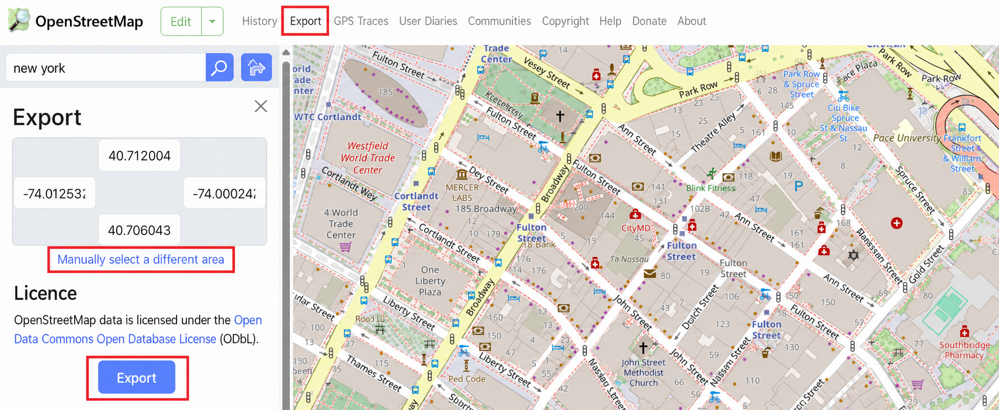
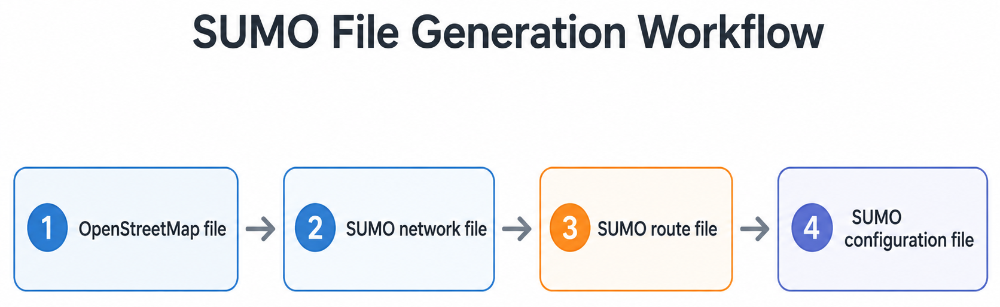
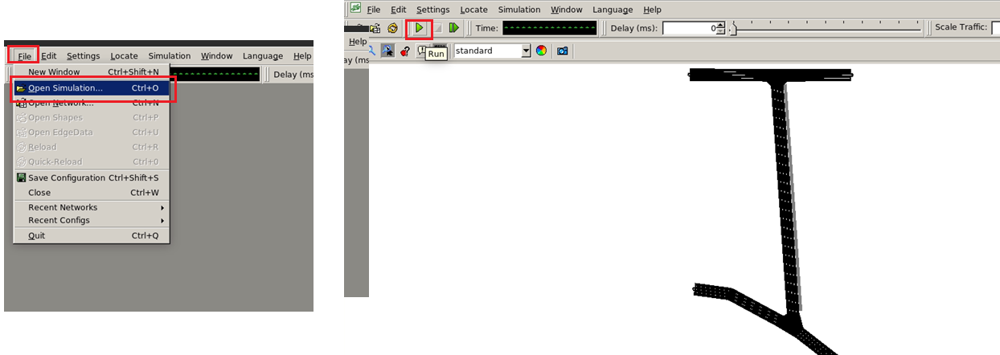

# 🔰 How to Create a Base Scenario

This guide describes the files and resources required to create a Raymobtime base scenario. A base scenario contains the static environment and configuration files used by the mobility, ray-tracing, image, and LiDAR simulation stages.

The document also presents the auxiliary files required during post-processing and explains how detailed object templates can be created for vehicles, pedestrians, drones, and other dynamic objects.

## 1. Base Scenario Overview

A Raymobtime base scenario contains the static files required to reproduce the simulation environment. These files describe the geographic area, road network, mobility configuration, three-dimensional geometry, and wireless propagation scenario.

A typical scenario directory is organized as follows:

```text
📁 data/
└── 📁 <scenario_name>/
    ├── 📁 base/
    │   ├── 🗺️  osm/
    │   │   └── Geographic and map source files
    │   │
    │   ├── 🚦 sumo/
    │   │   └── Network, routes, and mobility configuration
    │   │
    │   ├── 🎥 blender/
    │   │   └── 3D scenario, cameras, and Blensor resources
    │   │
    │   └── 📡 wi/
    │       └── Wireless InSite base project and propagation files
    │
    └── 📁 outputs/sim_x
        └── Simulation results, processed data, images, scans, and channels
```

The exact directory names may vary according to the project configuration, but the base scenario should provide all files required before the simulation starts.

---

# Files Required for Simulation

## 2. OpenStreetMap File

### OSM file (`.osm`)

The OpenStreetMap file contains geographic information about the selected scenario, including roads, intersections, buildings, and other mapped elements.

It may be used to:

* generate the SUMO road network;
* identify road and junction positions;
* support the creation of realistic outdoor scenarios;
* align mobility and three-dimensional environment data;
* provide geographic references for scenario conversion.

The file is usually exported from OpenStreetMap or another compatible geographic data source.

<p align="center">
  
</p>
<p align="center">
  <em>OpenStreetMap export interface used to select and download the scenario region.</em>
</p>

To export the OSM file, access the [OpenStreetMap website](https://www.openstreetmap.org/), search for the desired geographic region, and adjust the map view so that the complete simulation area is visible. Then, click **Export** in the top menu and select **Manually select a different area** to define the region more precisely. Adjust the selection boundaries to include the roads, intersections, buildings, and surrounding area required by the simulation, and click **Export** to download the file. The downloaded file can then be renamed according to the scenario and stored in the corresponding base directory.

---

## 3. SUMO Files

SUMO is responsible for generating the mobility of vehicles, pedestrians, drones, and other dynamic objects in Raymobtime. A basic SUMO scenario requires three main files: a network file, a route file, and a simulation configuration file.

The files are created in the following order:

<p align="center">
  
</p>

<p align="center">
  <em>Workflow for generating the SUMO network, route, and configuration files from an OpenStreetMap file.</em>
</p>

### 3.1 Network File (`.net.xml`)

The network file contains the road infrastructure used by SUMO. It defines edges, lanes, junctions, connections, traffic directions, speed limits, lane permissions, pedestrian access, and the geometric representation of the roads.

The `.net.xml` file is generated from the OpenStreetMap file exported in the previous section using the SUMO `netconvert` tool. Open a terminal in the directory containing the `.osm` file and execute:

```bash
netconvert --osm-files input_file.osm --numerical-ids.edge-start 0 --numerical-ids.node-start 0 -o output_file.net.xml
```

The command used in the tutorial assigns numerical identifiers to the generated edges and nodes. The option:

```bash
--numerical-ids.edge-start 0
```

configures edge identifiers to start at `0`, while:

```bash
--numerical-ids.node-start 0
```

configures junction or node identifiers to start at `0`.

It is also possible to filter the road types imported from OpenStreetMap. The `--keep-edges.by-type` option keeps only the specified road categories. For example:

```bash
netconvert \
    --osm-files input_file.osm \
    --numerical-ids.edge-start 0 \
    --numerical-ids.node-start 0 \
    --keep-edges.by-type highway.primary,highway.secondary,highway.tertiary,highway.residential \
    -o output_file.net.xml
```

In this example, only primary, secondary, tertiary, and residential roads are preserved in the generated SUMO network.

Alternatively, the `--remove-edges.by-type` option removes selected road categories:

```bash
netconvert \
    --osm-files input_file.osm \
    --numerical-ids.edge-start 0 \
    --numerical-ids.node-start 0 \
    --remove-edges.by-type highway.footway,highway.path,highway.cycleway \
    -o output_file.net.xml
```

The `--keep-edges.by-type` and `--remove-edges.by-type` options should be selected according to the desired scenario. They should not be written together using `/`; the slash shown in the tutorial indicates that either option may be used.

When the scenario includes pedestrians, sidewalks and pedestrian crossings can also be generated:

```bash
netconvert \
    --osm-files input_file.osm \
    --numerical-ids.edge-start 0 \
    --numerical-ids.node-start 0 \
    --osm.sidewalks true \
    --osm.crossings true \
    -o output_file.net.xml
```

The generated network should be inspected before creating the route file. It can be opened in NetEdit using the SUMO graphical interface.

During this inspection, verify that the required roads are present, the directions are correct, the network is connected, and the lanes allow the intended object classes .The edge and lane identifiers required by the route file can be inspected directly in `scenario.net.xml` or through the graphical interface of NetEdit.

> **Note:** The initial network filtering can be performed directly during the OSM conversion by using options such as `--keep-edges.by-type` or `--remove-edges.by-type`. These options are useful for automating the removal of unnecessary road categories at the beginning of the scenario-creation process. However, the generated network can also be opened and manually edited in NetEdit, where unwanted edges, lanes, junctions, and connections can be removed and the resulting `.net.xml` file can be saved. Regardless of the method used, the final network file should contain only the elements required by the simulation, reducing scenario complexity and avoiding invalid or irrelevant mobility routes.

> **Note:** The SUMO network offset must be adjusted to synchronize its coordinate system with the Wireless InSite scenario. This procedure is introduced in the SUMO section and explained in more detail later in the coordinate-system alignment section.


---
### 3.2 Route File (`.rou.xml`)

The route file defines the dynamic objects that move through the SUMO network. It contains the object types, routes, traffic flows, departure intervals, and mobility parameters used during the simulation.

A route file may include conventional vehicles, pedestrians, and drones. Vehicle types describe physical and mobility properties such as length, width, height, acceleration, maximum speed, and behavior parameters. These values are also used by Raymobtime when placing the corresponding objects in Wireless InSite, Blender, and Blensor.

A minimal route file has the following structure:

```xml
<?xml version="1.0" encoding="UTF-8"?>

<routes>

    <!-- Object types and mobility flows are defined here. -->

</routes>
```

#### Vehicle flow

Conventional vehicles may be defined individually or through a type distribution. A distribution allows each generated vehicle to be randomly assigned to one of the configured types.

A vehicle flow specifies the period in which vehicles are generated, the probability of generation, the object type or distribution, and the route followed through the network.

```xml
<flow
    id="flow0"
    begin="10"
    end="100"
    probability="0.41"
    type="typeVehicleDistribution">

    <route edges="E0 E1 E2"/>

</flow>
```

The edges listed in the route must exist in the `.net.xml` file, follow a valid travel direction, and be connected in the specified order.

#### Pedestrian flow

Pedestrians are represented using a type with `vClass="pedestrian"` and a `<personFlow>` element containing a walking stage.

```xml
<vType
    id="Pedestrian"
    vClass="pedestrian"
    speedFactor="1.0"
    length="0.5"
    width="0.5"
    height="1.72"/>
```

```xml
<personFlow
    id="pedFlow0"
    begin="10"
    end="100"
    probability="0.20"
    type="Pedestrian">

    <walk edges="P0 P1"/>

</personFlow>
```

The selected edges must contain lanes that allow pedestrian movement.

#### Drone flow

Drones are represented in SUMO as objects following a predefined horizontal route.

```xml
<vType
    id="Drone"
    length="0.5"
    width="0.5"
    height="0.2"
    accel="2.0"
    decel="2.0"
    maxSpeed="10.0"/>
```

```xml
<flow
    id="droneFlow0"
    begin="10"
    end="100"
    probability="0.10"
    type="Drone">

    <route edges="E0 E1 E2"/>

</flow>
```

SUMO provides the horizontal trajectory of the drone. The `height` attribute defines its physical size and not its flight altitude. Raymobtime applies the configured altitude offset when the drone is placed in the three-dimensional simulation environments.

> **Note:** The identifiers assigned to the object types, such as `Car`, `Truck`, `Bus`, `Pedestrian`, and `Drone`, are used by Raymobtime to select the corresponding detailed object templates. Therefore, these identifiers should remain consistent with the available models and runtime configuration.

#### Automatic route-file generation

Raymobtime currently provides a Python utility that automatically generates a generic `.rou.xml` file. The script writes a predefined vehicle type distribution and creates multiple flows over a configured simulation interval.

Its main parameters are:

| Parameter         | Description                                         |
| ----------------- | --------------------------------------------------- |
| `output_file`     | Path or name of the generated `.rou.xml` file       |
| `initial_time`    | Beginning time of the first generated flow          |
| `end_time`        | Maximum simulation time                             |
| `time_step`       | Interval between the beginning of consecutive flows |
| `flow_duration`   | Intended duration of each flow                      |
| `initial_flow_id` | Initial offset used to generate flow identifiers    |

During execution, the script performs the following operations:

1. creates the XML header and the `<routes>` element;
2. writes the standard vehicle distribution for cars, trucks, and buses;
3. iterates from `initial_time` to `end_time` using `time_step`;
4. assigns a unique identifier to each generated flow;
5. generates a random flow probability;
6. assigns the configured route to each flow;
7. writes the resulting content to the output file.

A simplified usage example is:

```python
generate_generic_route_file(
    output_file="scenario.rou.xml",
    initial_time=5,
    end_time=9000,
    time_step=10,
    flow_duration=5,
)
```
---

### 3.3 SUMO Configuration File (`.sumocfg`)

The SUMO configuration file connects the network and route files and defines the main simulation settings.

Create a file named:

```text
scenario.sumocfg
```

A minimal configuration is:

```xml
<?xml version="1.0" encoding="UTF-8"?>

<configuration>

    <input>
        <net-file value="scenario.net.xml"/>
        <route-files value="scenario.rou.xml"/>
    </input>

    <time>
        <begin value="0"/>
        <end value="100"/>
        <step-length value="0.1"/>
    </time>

</configuration>
```

The file paths are interpreted relative to the directory containing the `.sumocfg` file. If the three files are stored in the same directory, only their filenames are required.


The files should be organized as:

```text
sumo/
├── scenario.net.xml
├── scenario.rou.xml
└── scenario.sumocfg
```

The original OSM file may be kept in the same directory or in a dedicated OSM directory:

```text
base/
├── osm/
│   └── scenario.osm
└── sumo/
    ├── scenario.net.xml
    ├── scenario.rou.xml
    └── scenario.sumocfg
```

---
### 3.4 Validating the SUMO Scenario

After creating the network, route, and configuration files, the complete mobility scenario should be validated using the SUMO graphical interface. Open SUMO GUI, select **File → Open Simulation**, and load the corresponding `.sumocfg` file. Once the configuration is loaded, click the **Run** button to start the simulation and observe the movement of the configured vehicles, pedestrians, and drones throughout the road network.

<p align="center">
  
</p>

<p align="center">
  <em>Opening the SUMO configuration file and running the mobility simulation in SUMO GUI.</em>
</p>

During validation, confirm that the road network is displayed correctly and that the dynamic objects enter and move through the scenario according to the expected routes and simulation times. The visualization should also be used to identify disconnected edges, invalid routes, incorrect lane permissions, unexpected vehicle behavior, or objects leaving the intended simulation area.

Before using the scenario in Raymobtime, verify that:

* the network and configuration files load without errors;
* every route references valid edges from the `.net.xml` file;
* consecutive edges are connected and follow a valid travel direction;
* vehicle lanes permit the configured vehicle classes;
* pedestrian routes use lanes that allow pedestrian movement;
* the simulation start time, end time, and time step are correct;
* vehicles, pedestrians, and drones enter the network as expected;
* objects do not become teleported because of disconnected or congested routes;
* the traffic density and flow probabilities are appropriate for the scenario;
* the selected mobility area is spatially consistent with the Wireless InSite and Blender environments.

The final `.net.xml` file should contain only the roads, lanes, junctions, and connections required by the intended mobility simulation. Unnecessary elements may increase scenario complexity and make route validation more difficult.

Once the SUMO scenario runs correctly, the resulting files can be used as the mobility base from which Raymobtime generates the sequence of scenes and episodes.

## 4. Blender Scenario

### Blender file (`.blend`)

The Blender file contains the three-dimensional representation of the simulation environment and is used in two main stages of the Raymobtime workflow. First, Blender is used to import, inspect, clean, and export the relevant scenario geometry to Wireless InSite. Second, the resulting `.blend` file is used as the visual and sensing environment for RGB image generation and LiDAR simulation.

The Blender scenario may include buildings, roads, sidewalks, vegetation, street furniture, vehicles, cameras, lighting sources, and other static environmental elements. Before the scenario is used by Raymobtime, unnecessary objects should be removed and the remaining geometry should be organized so that only the elements required by the simulation are preserved.

### 4.1 Blender Versions

Two Blender versions are currently used in the Raymobtime workflow.

[Blender 3.6.9](https://www.blender.org/download/releases/3-6/) is the main version used for 3D modeling, scene cleaning, object organization, and geometry export. It provides the preferred environment for editing large scenarios and preparing the meshes that will later be imported into Wireless InSite.

[Blender 2.79b](https://www.blender.org/download/releases/2-79/) is maintained for compatibility with  Blensor and older versions of some map-importing tools depend on this Blender release.

The final scenario may therefore be prepared in Blender 3.6.9 and later opened or adapted in Blender 2.79b when LiDAR simulation through Blensor is required.

### 4.2 Importing the Geographic Scenario

OpenStreetMap data can be imported into Blender using the Blosm add-on. Blosm converts geographic map information into three-dimensional objects, including buildings, roads, terrain, and other mapped structures.

The following versions have been used in the Raymobtime workflow:

* [Blosm 2.7.9](https://github.com/vvoovv/blosm), compatible with Blender 3.6.9;
* [Blosm 2.4.21](https://github.com/vvoovv/blosm/releases/tag/v2.4.21), compatible with Blender 2.79.

The imported region should correspond to the same geographic area used by the SUMO and Wireless InSite scenarios. Spatial consistency among these environments is required so that mobility, wireless propagation, RGB images, and LiDAR scans represent the same scene.

### 4.3 Cleaning and Preparing the Scenario

After importing the scenario, the Blender scene should be cleaned before export. The objective is to preserve only the geometry required for the propagation and sensing simulations.

The cleaning process may include:

* removing objects outside the analysis area;
* removing unnecessary vegetation or decorative elements;
* simplifying highly detailed meshes;
* separating buildings, roads, terrain, and other object categories;
* checking surface normals;
* joining or separating objects according to the desired export strategy;
* assigning meaningful names to the remaining objects.

> **Note:** Add a plane to the Blender scenario to represent the ground surface, since the geometry imported from OpenStreetMap may not include a continuous floor. The roads should be positioned slightly above this plane to avoid overlapping surfaces, rendering artifacts, and incorrect LiDAR intersections.


Large or unnecessarily detailed meshes can increase the Wireless InSite import time and the computational cost of the ray-tracing simulation. Therefore, the final scenario should contain only the objects that have a relevant effect on propagation, image generation, or LiDAR sensing.

The [Super Batch Export](https://github.com/mrtripie/Blender-Super-Batch-Export) add-on can be used to automate the export of multiple Blender objects. This is useful when buildings or groups of objects must be exported individually while preserving their organization.

### 4.4 Exporting Geometry to Wireless InSite

After the scene has been cleaned, the relevant meshes must be exported from Blender and imported into Wireless InSite.

Two export formats have been evaluated in the Raymobtime workflow:

* COLLADA (`.dae`);
* STL (`.stl`).

#### COLLADA export

The COLLADA format can preserve the separation between objects and provides a structured representation of the scene geometry. It is useful when the imported scenario should maintain individual buildings or object groups.

#### STL export

The STL format stores only the surface geometry of the exported meshes. It is simpler than COLLADA and may be useful when the scenario geometry can be treated as a single static model.

STL does not preserve materials, object hierarchy, or semantic information. Therefore, additional work may be required inside Wireless InSite to separate objects or assign propagation materials.

The selected export format should be evaluated according to the scenario complexity and the desired organization inside Wireless InSite. Regardless of the format, the exported geometry must maintain the same scale, orientation, and origin used by SUMO and Blender.

> **Note:** Before exporting, apply the Blender object transformations and verify the coordinate axes. Incorrect scale, rotation, or origin values may cause the scenario to be misplaced after import into Wireless InSite.

### 4.5 Preparing the `.blend` File for RGB Images

The `.blend` file is also used by Raymobtime to generate RGB images. In the case of base-station image generation, the cameras must be manually created and positioned in the Blender scene. For user-equipment image generation, the cameras are automatically added by the Raymobtime pipeline according to the positions of the corresponding receivers.

The scene should contain the static geometry required for visual rendering and appropriate lighting conditions. Depending on the scenario, illumination may need to be added manually using sunlight, point lights, area lights, or other Blender light sources.

Raymobtime expects camera objects with sequential names such as:

```text
Camera0
Camera1
Camera2
```

The number of cameras available in the `.blend` file must match the value defined in the Raymobtime configuration.

Each camera should be checked for:

* position;
* orientation;
* focal length;
* sensor width and height;
* image resolution;
* clipping distance;
* field of view;
* visibility of the analysis area.

Raymobtime exports the camera information during post-processing and uses it to generate the intrinsic and extrinsic camera parameters associated with the rendered images.

### 4.6 Preparing the `.blend` File for LiDAR

The same Blender scenario is used by Blensor to generate synthetic LiDAR point clouds. Blensor runs with Blender 2.79b and simulates the interaction between the sensor rays and the three-dimensional environment.

Before LiDAR generation, verify that:

* the scenario opens correctly in Blender 2.79b;
* all required meshes are visible;
* the object scale is correct;
* the dynamic vehicle models can be inserted;
* the sensor object exists in the scene;
* the analysis region is within the sensor range;
* no unsupported Blender features are required by the scene.

Raymobtime positions the LiDAR sensor according to the selected transmitter or receiver and generates point clouds for the corresponding scenes. The Blensor parameters may define angular resolution, maximum distance, rotation speed, noise, and scanning range.

---
## 5. Wireless InSite Base Scenario

The Wireless InSite base scenario contains the static geometry, materials, antennas, waveforms, communication nodes, propagation model, and study-area configuration required for electromagnetic ray-tracing simulations.

The current Raymobtime workflow has been tested with **Wireless InSite 3.3 and 3.2**. Other versions may use different project formats, menus, or configuration files and should be validated before being integrated into the pipeline.

### 5.1 Required Resources

The Wireless InSite base directory should contain the static scenario geometry and the project files required by Raymobtime. The exact files generated by Wireless InSite may vary according to the software version and project configuration.

The `base.object` file represents the static scenario imported from Blender, while `random-line.object` is used as a reference object required by the Raymobtime Wireless InSite workflow.

> **Note:** The file names expected by the source code and configuration must match the names stored in the scenario directory.

### 5.2 Preparing the Object Files

Place `random-line.object` in the Wireless InSite `meshes` directory associated with the scenario. When the files are generated or edited on Linux and later opened on Windows, their line endings may need to be converted to the Windows format. From the `meshes` directory, execute:

```bash
find . -type f -print0 | xargs -0 -n 1 -P 4 unix2dos
```

This command converts the line endings of every file inside the current directory.

After conversion, copy the mesh files to the Windows directory used by the Wireless InSite project.

> **Note:** Apply this command only to text-based Wireless InSite resources. Binary geometry or project files should not be processed with `unix2dos`.

### 5.3 Creating the Wireless InSite Project

Open Wireless InSite and create a new project for the selected scenario.

The project must represent the same static environment prepared in Blender and the same geographic region used by SUMO.

The preparation procedure is:

1. open the **Geometry** workspace;
2. import `random-line.object` as an object;
3. confirm that the object is visible in the project;
4. import the scenario meshes as a city or static geometry;
5. inspect the imported scale, position, and orientation;
6. remove duplicated or misplaced objects;
7. save the project before configuring the propagation elements.

The `random-line.object` file should appear as a small metallic block or reference geometry. If it does not appear, verify the object-file format, file path, and line endings.

The scenario geometry imported from Blender may use COLLADA, STL, or converted Wireless InSite object files, depending on the selected workflow.

### 5.4 Materials

After importing the scenario, propagation materials must be assigned to the static structures. Materials should be selected according to the physical characteristics of each surface.
The material definitions influence reflection, transmission, diffraction, and path loss. Therefore, the most relevant structures should receive suitable electromagnetic properties before the ray-tracing simulation is executed.

> **Note:** The ground plane added during Blender scenario preparation should also receive an appropriate material in Wireless InSite.

### 5.5 Waveform Configuration

Create the waveform used by the wireless propagation simulation. The waveform should be defined as a sinusoidal signal and configured with the carrier frequency required by the dataset.

### 5.6 Antenna Configuration

Create the transmitter and receiver antennas used by the scenario. The base project should contain reference transmitter and receiver objects. Use the following naming convention:

```text
Tx
Rx
```

Raymobtime expects these names when modifying the communication nodes for each generated scene.

The initial positions of `Tx` and `Rx` should be checked carefully. Even though Raymobtime may update their positions during execution, the base project must contain valid transceiver objects with correctly assigned antennas and waveforms.

> **Important:** Avoid changing the names `Tx` and `Rx` unless the corresponding Raymobtime source code and configuration are also updated. In addition, Wireless InSite may not reuse the identifier of a deleted antenna. For example, if antennas with IDs `1`, `2`, `3`, and `4` exist and antenna `2` is deleted, the next antenna created may receive ID `5`, resulting in the sequence `1`, `3`, `4`, `5`. The current Raymobtime workflow expects antenna identifiers to follow a continuous sequence such as `1`, `2`, `3`, `4`, and gaps in this sequence may cause incorrect antenna associations or parsing errors. Therefore, after deleting antennas, verify the generated IDs and recreate or reorganize the antenna definitions when necessary to preserve a continuous identifier sequence.

### 5.7 Study Area Configuration

Create a study area and name it:

```text
study
```

The study-area name is used by the Raymobtime workflow and should remain consistent with the generated project files.

Configure the study area with the following settings:

* **Short description:** `study`;
* **Propagation model:** X3D;
* **Transmitter:** `Tx`;
* **Receiver:** `Rx`;
* **Waveform:** the waveform created for the scenario;
* **Antennas:** the configured transmitter and receiver antennas;
* **Number of rays per Tx–Rx pair:** according to the desired accuracy and computational cost.

The X3D propagation model should be configured according to the scenario requirements, including the enabled reflection, transmission, and diffraction mechanisms.

### 5.9 Validating the Base Simulation

Before using the project in Raymobtime, execute a test simulation directly in Wireless InSite. Click the **Run** button and verify that the X3D simulation completes successfully.

After execution, inspect the generated rays and confirm that:

* propagation paths exist between `Tx` and `Rx`;
* the transmitter and receiver are inside the valid simulation region;
* the study area is active;
* the antennas and waveform are correctly assigned;
* reflections and other propagation mechanisms behave as expected;
* the imported scenario geometry does not block all paths unexpectedly;
* the selected outputs are generated;

### 5.10 Saving the Raymobtime Base Files

After validating the simulation, save the Wireless InSite project with the name:

```text
model
```
Wireless InSite will generate the project resources associated with this name.

Copy or rename the required files as follows:

```text
model.txrx       → base.txrx
model.study.xml  → base.study.xml
```

The resulting Raymobtime base files should therefore include:

```text
base.txrx
base.study.xml
```
These files are used as templates by Raymobtime when generating run-specific transmitter, receiver, and study-area configurations.

Do not modify the original validated files without preserving a backup. It is recommended to keep both the original `model` project and the derived `base` files.

### 5.11 Coordinate-System Alignment

The Wireless InSite, Blender, and SUMO scenarios must represent the same physical region using compatible coordinates.

Identify a known reference point in the Wireless InSite scenario, preferably the point corresponding to:

```text
x = 0
y = 0
```

Then locate the same physical point in the SUMO network file.

The SUMO coordinate transformation is defined by the `netOffset` value inside the `.net.xml` file. A typical network location element is:

```xml
<location
    netOffset="x_offset,y_offset"
    convBoundary="..."
    origBoundary="..."
    projParameter="..."/>
```

Adjust the `netOffset` so that the selected SUMO reference point matches the Wireless InSite origin.

The objective is to ensure that an object retrieved from SUMO and converted by Raymobtime appears at the corresponding physical location in Wireless InSite.

The alignment procedure is:

1. select a visible and unambiguous reference point;
2. record its coordinates in Wireless InSite;
3. identify the same point in the SUMO network;
4. calculate the required horizontal offset;
5. update the SUMO `netOffset`;
6. run the Raymobtime placement stage;
7. visually inspect the generated Wireless InSite scenario;
8. repeat the adjustment if necessary.

> **Important:** Do not validate alignment using only coordinate values. Run the Raymobtime placement procedure and confirm visually that vehicles, pedestrians, drones, transmitters, and receivers are positioned correctly relative to roads and buildings.

An incorrect offset may cause:

* vehicles to appear inside buildings;
* antennas to be placed outside the study region;
* pedestrians to appear away from sidewalks;
* image and LiDAR data to become inconsistent with wireless results;
* invalid transmitter–receiver geometry.

> **Note:** For more informations read the Wireless Insite documentation.

# Files for Post-processing

## 6. Antenna Codebook

The antenna codebook contains the beamforming vectors and antenna configurations used during wireless channel generation and processing, including beam identifiers, antenna weights, phase shifts, beam directions, and transmitter and receiver beam definitions. In the codebook matrix, each row corresponds to one antenna element, while each column corresponds to one codeword or beamforming configuration. Therefore, the number of rows must match the number of antenna elements in the array, and the number of columns defines the total number of available codewords. During codebook processing, the Raymobtime code iterates over the matrix columns, applying one codeword at a time. The selected codebook must be compatible with the antenna array and channel representation used by the scenario. Codebooks are typically stored in `assets/codebooks/`, for example `assets/codebooks/default_mikrotik_cb.npy`.

## 7. H-Matrix Configuration

The H-matrix represents the wireless channel between the transmitter and receiver antenna elements. In the current project, this resource is associated with the **isolated simulation** feature and does not belong to the standard Raymobtime simulation flow.

This feature was designed for experiments using **Wireless InSite 4.0**, in which a Uniform Planar Array (UPA) is modeled directly inside Wireless InSite. The objective is to simulate the element-to-element wireless channel, export the resulting channel matrix, and subsequently apply a selected beamforming codebook during post-processing.

The intended workflow is:

1. define the transmitter and receiver antenna arrays directly in Wireless InSite;
2. configure the UPA dimensions, element spacing, orientation, and carrier frequency;
3. execute the electromagnetic propagation simulation;
4. export the channel matrix between the antenna elements;
5. load the exported H-matrix in the isolated simulation module;
6. apply the desired transmitter and receiver codebooks;
7. evaluate the resulting beamformed channel or beam-sweeping response.

In this approach, the H-matrix is generated before codebook application. This makes it possible to reuse the same simulated channel with different codebooks without rerunning the Wireless InSite propagation simulation.


The corresponding scenario documentation should specify the transmitter and receiver array dimensions, antenna-element spacing, carrier frequency, matrix dimensions, channel convention, and codebooks applied during beamforming.

> **Note:** The H-matrix workflow is an experimental feature intended for isolated channel and beamforming studies. It is not part of the standard Raymobtime pipeline based on mobility generation, dynamic placement, and run-specific Wireless InSite simulations.

---

# Extra: Creating an Object Template

## 10. Detailed Object Templates

Raymobtime can represent dynamic objects either as simplified rectangular prisms or as detailed Wireless InSite object templates. Detailed templates provide a more realistic geometric representation of vehicles, pedestrians, drones, and other mobile objects during propagation simulations.

The recommended workflow is:

1. create or import the three-dimensional model in Blender;
2. adjust its scale, orientation, and origin;
3. export the model from Blender;
4. import the exported geometry into Wireless InSite;
5. save the imported geometry as a Wireless InSite `.object` file;
6. manually remove the project-specific header and control-vector section;
7. store the cleaned template in the Raymobtime assets directory.

Typical templates are stored in:

```text
assets/wi_objects/
```

### 10.1 Preparing the Model in Blender

The object should first be prepared in Blender. Before exporting, verify that:

* the model has the correct physical dimensions;
* the scale has been applied;
* the rotation has been applied;
* the object origin is positioned consistently;
* the object faces the expected forward direction;
* unnecessary meshes and modifiers have been removed;
* the geometry does not contain duplicated vertices or invalid faces.

The model orientation is especially important because Raymobtime rotates the template according to the mobility direction obtained from SUMO. An incorrectly oriented base model may appear sideways or backwards after placement.

### 10.2 Importing and Saving the Object in Wireless InSite

Export the model from Blender using a format supported by Wireless InSite, such as COLLADA or STL, and import it into the Wireless InSite geometry workspace.

After confirming that the model has the correct scale and orientation, save it as a Wireless InSite object file:

```text
object_name.object
```

The file generated directly by Wireless InSite may contain project-specific metadata that should not be included in a reusable Raymobtime template.

### 10.3 Cleaning the `.object` File

Open the generated `.object` file in a text editor and remove the initial header so that the first relevant line of the template is:

```text
begin_<structure_group> 0
```

The exact structure name may vary according to the object generated by Wireless InSite, but the cleaned file must begin with the corresponding `begin_<structure_group>` declaration.

At the end of the file, remove the complete control-vector block:

```text
begin_<ControlVectors>
CVsVisible no
Stippled no
CVsThickness 3
CVxLength 10.0000000000
CVyLength 10.0000000000
CVzLength 10.0000000000
CVsXaxis 1.0000000000 0.0000000000 0.0000000000
CVsZaxis 0.0000000000 0.0000000000 1.0000000000
end_<ControlVectors>
```

After this removal, the file should contain only the object geometry and structure definitions required by the Wireless InSite parser.

> **Important:** The template must not contain the original project header or the `ControlVectors` block. Raymobtime inserts the cleaned object content into generated Wireless InSite scenarios, and additional project-level sections may produce duplicated definitions or parsing errors.